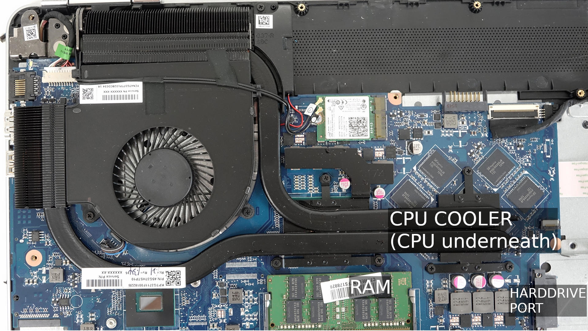
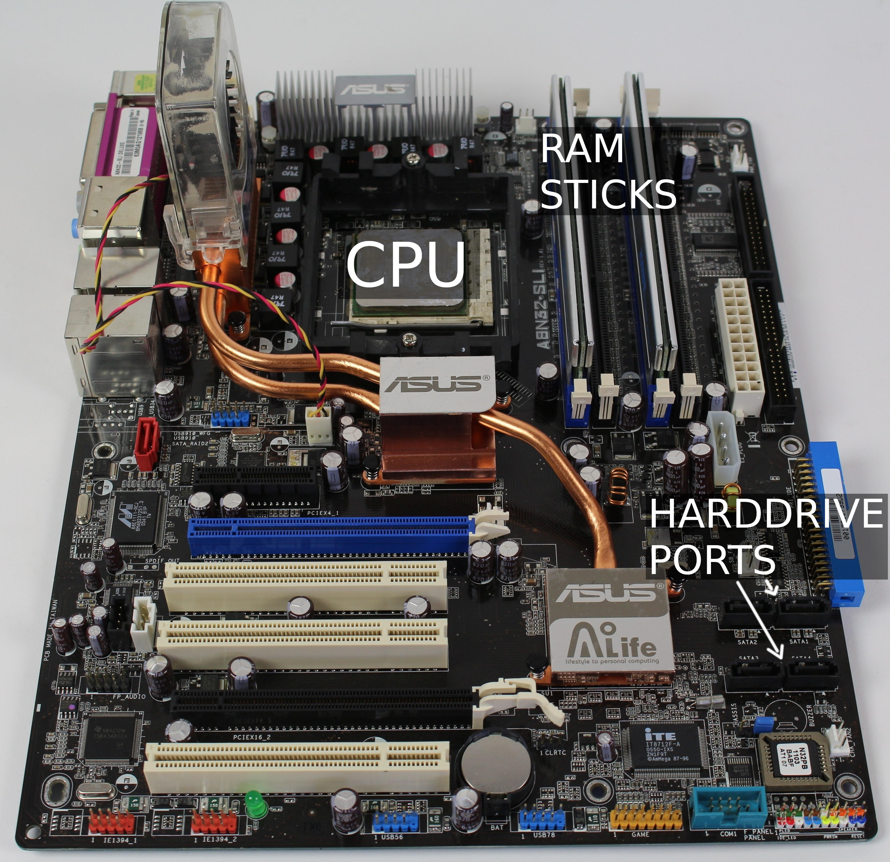
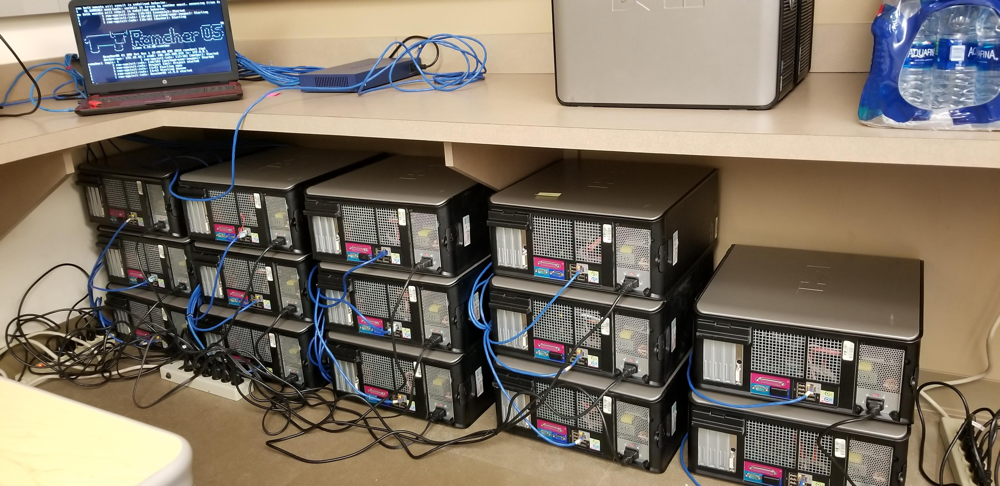

# Introduction

By this point in your studies, you should at least know the basics about what a computer is. In this chapter, we'll dive a little bit deeper into the inner workings of these things so that you may have more context to what we discuss in the future sections and chapters.

## Computer Hardware

You are likely used to interacting two things: either a laptop, a desktop computer or both. These two things have commonalities between them, and those are the components that make the computers inside them operate. A laptop is a computer in a different form-factor.

What are these components that make a computer work?

Some of the basics are as follows:

| Component                     | Description |
|-------------------------------|-------------|
| Central Processing Unit (CPU) | This is like the brain of the computer. It is responsible for processing what you want to have the computer do. |
| Motherboard                   | Think of this as similar to the nervous system and blood stream. It connects components and transfers information between them. |
| Random Access Memory (RAM)    | This is like your short-term memory. It is really fast storage which is physically closest to the CPU. |
| Hard drive/Solid state drive  | This is like your long-term storage. It is slower than RAM and physically further away but it can store much more information. |
| Case/enclosure                | This is like your body. It's the shell that the computer or laptop components sit in. |

### Laptops

Let's have a look at laptops first, since that is what most of you would be most familiar with at university. A laptop is just a shell that contains various components, such as a monitor, a keyboard, a trackpad (mouse movement), speaker and the components that make the computer operate as well.

Here is a picture of a laptop that has had its shell removed. This is the motherboard of the laptop.

Here you can see the CPU, which sits under this copper tube that transfers heat towards a fan. The RAM is just below it and the harddrive port (there is no harddrive attached in this picture) is close by as well.

There are a whole bunch of other ports that we can talk about, but it is not important for now.

### Desktops

For comparison, a desktop is generally a larger setup that has the components housed inside a tower case. The same basic components exist in a desktop PC, though sometimes they are larger. The components inside a laptop are more thermally and power constrained than a PC generally is.

Here is a picture of a PC motherboard that has been taken out of a case.

This motherboard does not currently have a fan placed over the CPU, but it will have to if it is to be used. CPUs get incredibly hot and they need the heat to be moved away from them during operation.

## Cluster computers

A cluster, or cluster of computers, is a set of computers that have been networked together in order to perform a single duty across them all. This is in order to reduce the time that is taken to achieve said duty. This requires setup and configuration on both the hardware and the software side.

An example of what a cluster setup looks like follows:
