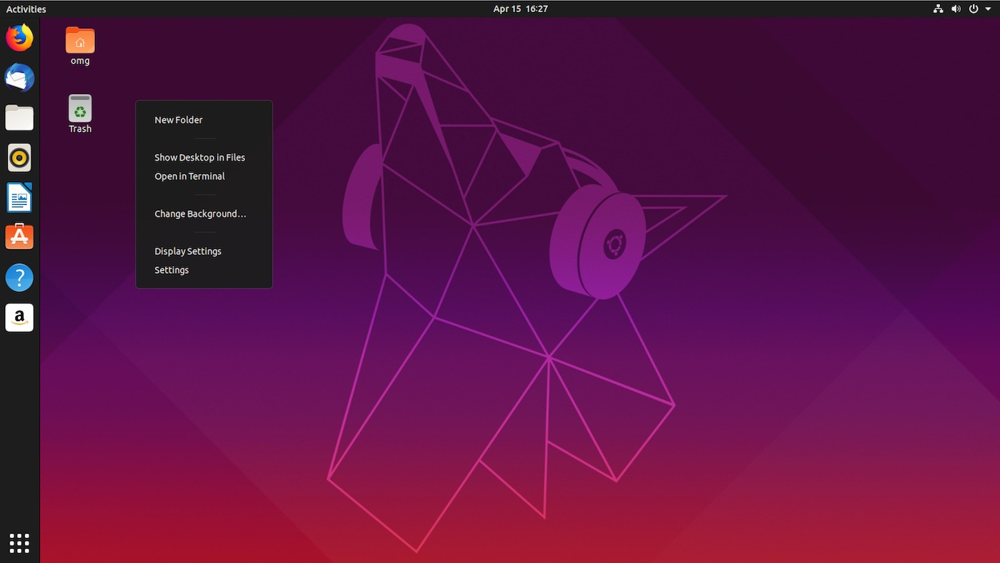
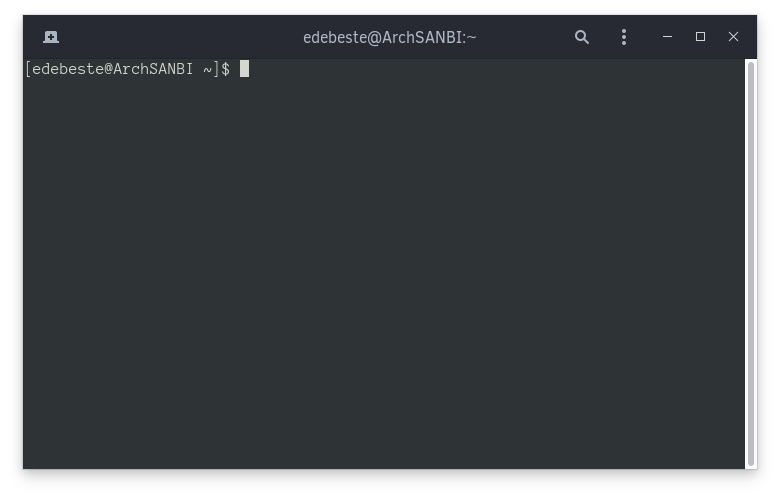

# Introduction to Linux

Linux is an alternative operating system for various different types of computers.

There are many different "flavours" of linux, which is to say that there are many different types of linux distributions that have different philosophies to the others. There is a lot of choice when it comes to this platform. Some distributions favour speed over stability and vice versa. Some offer the latest packages/software with minimal testing done before hand while others test packages/software for months before releasing updates. 

An example of one linux distribution (or flavour) is Ubuntu, one you may have heard of.

<figure>

<figcaption style="font-style: italic; display: flex; flex-direction: column; align-items: center">Desktop interface for Ubuntu 19.04</figcaption>
</figure>

One big difference between Windows and linux operating systems is that most of the software that you use on linux can and is installed via a "package manager". This is a piece of software that manages installs of software on your behalf and can fetch software from a central, trusted source. It can also be configured to fetch software from other sources.

Another big difference is that, while it is not strictly necessary, it's often the case that you will end up using the terminal a lot more in linux than in Windows.

## The linux terminal

The terminal is a window into the inner workings of a linux distribution. The graphical environment you're used to seeing interacts with the operating system the same way that the terminal does, it's just presented to you graphically. 

For example, when you open the file explorer to see your files, the graphical environment (desktop) will actually call a command the same way you would in the terminal to show you those files.

Here is an example of a linux terminal:


Here you see `[edebeste@ArchSANBI ~]$`. The first part, `edebeste`, represents the user account that you are logged into. My user account on my computer is called `edebeste`. The `@ArchSANBI` part represents the computer that you are using. My laptop is named `ArchSANBI`, so `edebeste@ArchSANBI` is saying that the user `edebeste` is logged into the machine (my laptop) `ArchSANBI`.

**The `~` represents that I am in my user accounts home folder**. The `$` shows that it is ready for your input to the terminal. From here on, you type a command and press enter to execute it.

## The linux filesystem

Unlike Windows, your "root" location, i.e. the "start" or top-level of where your files exist, do not sit on lettered drives. There is no concept of a `C:` drive on linux. Instead, you have a global filesystem root, represented by a `/` slash. I will demonstrate the similarities with a comparison between Windows and linux, because there are some basic overarching ideas, like users having account directories that contain their documents and etc.

Let's imagine that you have an account called "MyUser" in both Windows and Ubuntu. You want to get to a file that sits in your Documents folder called `mytextfile.txt`. The following examples will demonstrate where the file is.

### Windows example

In Windows, imagine the following structure:

* You have a `C:` drive, where all your files live.
* Inside `C:`, you have a folder/directory called `Users`.
* Inside `Users` there is a folder/directory called `MyUser`.
* Inside `MyUser` there are a bunch of folders/directories such as `Documents`, `Downloads`, `Pictures` and so forth.
* Inside the `Documents` folder/directory is your file called `mytextfile.txt`.

The full directory to get to `mytextfile.txt` would then be `C:\Users\MyUser\Documents\mytextfile.txt`.

Here is a nice way to represent it:

```
C:
└── Users
    └── MyUser
        ├── Desktop
        ├── Downloads
        └── Documents
            └── mytextfile.txt
```
### Linux example

In linux, specifically Ubuntu for this example, you will have a directory which is similar to `C:`, but it is shown as `/` instead. Imagine the following structure:

* You have `/` as the root of your drive, where all your files live.
* Inside `/` you have a directory called `home`, this is similar to `Users` on Windows.
* Inside `home` there is the directory for your user, called `MyUser`.
* Inside `MyUser` there are a bunch of directories such as `Documents`, `Downloads`, `Pictures` and so forth.
* Inside `Documents` is your file called `mytextfile.txt`.

The full directory to get to `mytextfile.txt` would then be `/home/MyUser/Documents/mytextfile.txt`.

The first `/` at the left represents the root or starting `/`. Every `/` after that shows that the name of the item before it (like `MyUser` in `MyUser/`) is a folder or directory.

Here is a nice way to represent it:

```
/
└── home
    └── MyUser
        ├── Desktop
        ├── Downloads
        └── Documents
            └── mytextfile.txt
```