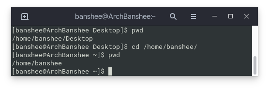

# Linux Basics

This chapter will guide you through some basics that you will need to know in order to get around with linux. We will be using Ubuntu as an example for the things that we do.

## Linux commands

There are some basic commands that you need to familiarize yourself with. This section will take you through some of them. I am logged into my home computer named `ArchBanshee`, with the user account `banshee` for the following examples.

### 1. pwd

This command shows you where you are currently situated in the linux filesystem, i.e. it shows you where you currently are.
<span style="display:block;text-align:center"></span>

### 2. ls

This command lists the contents of the directory that you are currently in.
<span style="display:block;text-align:center"></span>

### 3. cd

This is the command you need to change the directory you are in to another one. you use it by specifying `cd <path_you_want_to_go_to>`, for example: `cd /home/banshee` to go to my user's home directory.

In the image below I **was** inside `/home/banshee/Desktop`, but then I changed to `/home/banshee`. I use `pwd` to verify where I am.
<span style="display:block;text-align:center"></span>

### 4. rm & rm -r

This command is how you delete a file in the terminal. You use it by specifying the file you want to remove. For example: `rm /home/banshee/Desktop/steam.desktop`.

If you want to remove a directory, you need to add a switch to the `rm` command for recursively deleting a directory. You do this with the following command: `rm -r /home/banshee/Desktop`. This will remove the entire Desktop directory.
<span style="display:block;text-align:center"></span>

### 5. mkdir

This command creates a directory. It's used with `mkdir /path/to/directory`. For example, if I wanted to make a directory called `Games` inside of `/home/banshee`, I would use:

```
mkdir /home/banshee/Games
```

### 6. touch

Like mkdir, touch creates a file. It does not create directories. If I wanted to create a text file called `readme.txt` inside `/home/banshee/`, I would use:

```
touch /home/banshee/readme.txt
```

### 7. cp & mv

`cp` copies a file and `mv` moves (cuts) it. It works similar to touch. You specify `cp <file to copy> <file to paste>` or `mv <file to move> <where to move to>`.

If I have a file `/home/banshee/readme.txt` and I wanted to copy it to `/home/banshee/files/readme.txt` I would use:

```
cp /home/banshee/readme.txt /home/banshee/files/readme.txt
```
If I wanted to move it instead of copy it I would use:
```
mv /home/banshee/readme.txt /home/banshee/files/readme.txt
```

### 8. grep

Grep is a pattern/text matching tool. It's incredibly powerful. You'll use it a lot to find strings in configuration files. 

Let's say you have a book in a text file called mybook.txt. You want to find a sentence that starts with a specific line that you know. Assume this line is "In the end, she went off into". In order to find this in the book, you would use the grep command in the following way:

```
grep "In the end, she went off into" /path/to/mybook.txt
```

This will return the full line containing the string that you've searched for.

There are other ways of making grep useful, such as using a switch, `-n`, to tell you which lines it has occurred on, for example:

```
grep -n "In the end, she went off into" /path/to/mybook.txt
```
The above command will have line numbers stated before the string match.

### 9. wc

`wc` stands for word count. It's purpose is to tell you how many words are in a file. It can also tell you other things like how many lines there are in a file. To use it you just point it at the file you want to count. For example, to could how many lines there are in a file:

```
wc -l /path/to/file
```

## Linux command chaining

Where terminal commands become really powerful is when you combine multiple ones to achieve your goals. Let's consider an example:

You have a book `mybook.txt` that has 1000 pages in it. You want to know how many times the word "for" occurs in this book. It's going to be incredibly tedious to search for it by hand. We can combine the `grep` command command, to search for the word, with the `wc` command to count the amount of times.

How do that? Fist, let's see how we would individually run the two commands:

1. Getting the occurences of "for" with `grep`.
   ```
   grep -o "for" mybook.txt
   ```
   This will return the instances where "for" exists in the book. The `-o` part tells grep to not use the full line, but rather the occurance of each word even if there are more than one per line.

2. Getting the amount of lines in `mybook.txt`.
   ```
   wc -l mybook.txt
   ```
   This returns the number of how many lines there are in the book.

Now to combine commands we use the "pipe" command, which is `|`. The command works by taking the output of a command that is placed before it and sending it to the command listed after it, such as: `command1 | command2`.

In the case of our example, we'd use:

```
grep -o "for" mybook.txt | wc -l
```
This will give us a number that shows the exact amount of times that the word "for" is used in the book.

## Video runthrough

## Cheat sheet

Below listed are the commands that were specified above. Along with this, there are some additional commands listed here that you should familiarize yourself with as they will be very useful to naviagting around linux. Anything inside of the "<>" brackets are to be treated as a variable. Do not include the "<>" brackets if you type them.

| Command                             | Action |
|-------------------------------------|--------|
| `pwd`                               | Shows you which directory you are in. |
| `ls`                                | Lists the files and directories in the directory you are. |
| `ls /path/to/directory`             | Lists the contents in the directory you specified. |
| `cd`                                | Change to user home directory directory. |
| `cd /path/to/directroy`             | Change to directory you specified. |
| `rm /path/to/file`                  | Remove (delete) the specified file. |
| `rm -r /path/to/directory`          | Remove (delete) the specified directory. |
| `mkdir /path/to/directory`          | Create a new directory. |
| `touch /path/to/file`               | Create a new file. |
| `cp /source/file /destination/file` | Copies and pastes a file. |
| `mv /source/file /destination/file` | Moves (cuts) a file. |
| `grep "<name_of_string>" /file`     | Finds occurrances of "<name_of_string>" in a file. |
| `wc /file`                          | Counts words in a file, `wc -l` counts lines. |
| `sudo <command>`                    | Execute the command with root (admin) user privileges. E.g. `sudo ls`. |
| `sudo su`                           | Become the root (admin) user. |
| `cat /path/to/file`                 | Spits the content of a file out to the the screen. |
| `less /path/to/file`                | Smarter version of `cat`. Allows you to scroll better. |
