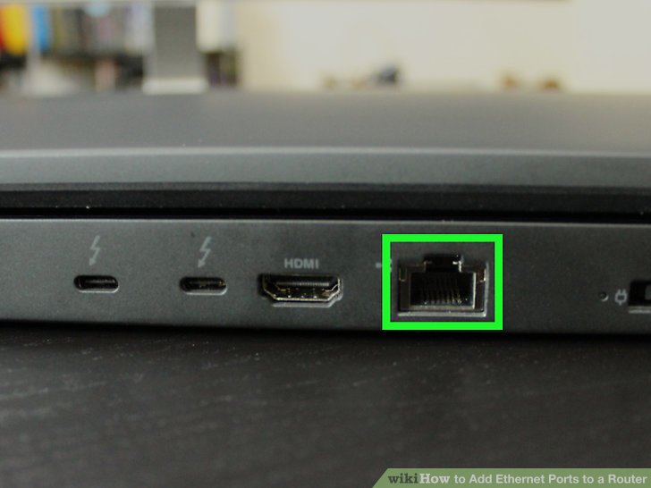
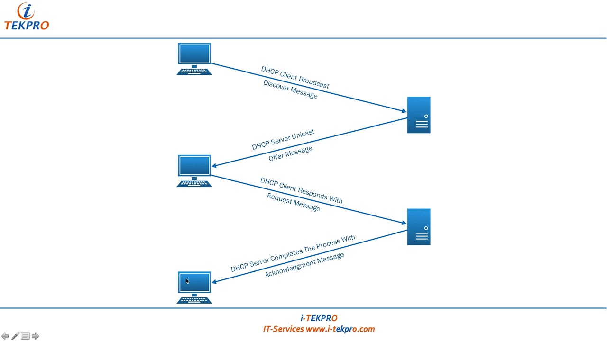

# Introduction to Networking

Networking is the act of connecting one or more computers together so that they may communicate with one another. This section will cover some really basic concepts to get you familiar with how to network Linux machines and basic network tools.

## Networks in General

In normal computers, networks are utilised via either and Ethernet/LAN port or a WiFi adapter. You may have a LAN port on your laptop, but some models do not have it. However, most desktop computers have one or more of these ports.

I am not going to go into too much detail about the network stack, but I will cover some of the basics.

When you connect two machines together, they speak to each other using identifiers called "IP Addresses". IP stands for Internet Protocol. You may have come across these numbers in the past. They can look like `10.0.0.12` or `192.168.1.25`, etc.

## CIDR

IP addresses exist in ranges. This is called the CIDR, or "Classless inter-domain routing", so that you can have multiple networks in one area and be allowed to separate them. For example, a machine with `10.0.0.1` will not normally be able to talk to a machine that has `192.168.0.1`, unless you specify routing.

IPv4 (the most common one still used today) is a 32-bit address space. Each of the dots represents 8 bits. 8bits.8bits.8bits.8bits. 8x4 = 32. You can specify the range of bits that are allowed to communicate with one another through the CIDR notation. It looks like `0.0.0.0/0`. The slash (`/`) at the end represents the amount of bits to shave off of the available IP space.

The number after the slash (`/`) is also known as the netmask.

### CIDR Definition Example

If we knew we wanted to support 254 machines with one IP range in the `10.0.0.x` space, we could specify that as `10.0.0.0/24`, the 24 is subtracted from the 32 bit total, leaving you with 8 bits. 2^8 = 256, but `10.0.0.0` and `10.0.0.255` are reserved IP addresses for the IP protocol, so we ignore those. That leaves us with 256 - 2 = 254 IP addresses. So that's `10.0.0.1 - 10.0.0.254`.

If you wanted to represent the CIDR in netmask (not using the slash), then you could say that the _network_ is `10.0.0.0` and the _netmask_ is `255.255.255.0`. This is because 2^8 (`x/24`, `32-24`) = 256. 0...255 = 256. `255.255.255.0` is `255.255.255.255` minus 256 at the end.

## DHCP

So how does it work when you plug a machine in and it automagically gets an IP address? When you plug your network cable in or connect to the WiFi on your router, a service that runs on your router called the DHCP server will receive a request from your computer asking for an IP. The procedure goes as follows:

- Computer is plugged in or connected to WiFi
- Computer broadcasts over `255.255.255.255` (a reserved IP address), asking for an IP address
- The router's DHCP server responds saying that it has an IP address for the computer
- The computer acknowledges that the DHCP server has an IP address for it and requests that IP
- The router's DHCP server send the IP address to the computer
- The computer assigns itself with the IP address

# Setting up Networking in Linux

-- TODO